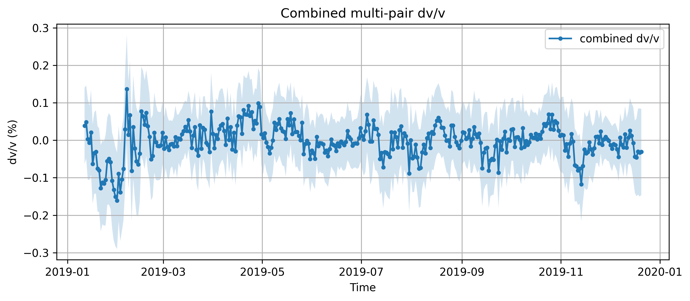

This is my first time using github and writing something formal, so please bear with me.

# Environment

In case you cannot run this code, try to import this environment I used:

environment.yml

by "conda env create -f environment.yml", you may want to change the name of this env, for it is very strange.
I tested this environment on BlueHive and it worked.

# compute_dvv.py
This is the program that will compute and save dvv into a csv file according to the given input. 

## Usage

python ./compute_dvv.py \
  --config THE_CONFIG_FILE.yaml \
  --no-save-csv \ if you do not want to save the result into csv \
  --plot \ if you want to save the plot as png \
  --rm \ whether to delete the last result \
  --skip \ whether to skip the correlation. Usually use this when the correlation result is already saved. 

you can also override the default value of save-csv, plot, rm and skip in config.yaml.

## Config.yaml
This is an example config that resembles the format of that paper. The program will make a folder called "CCF_ASDF" under its directory to store the Xcorrelation data. It saves the final result in "network_dvv.csv"

# network_dvv.csv
This is the file that contains the computed dv/v.

The structure is: Date, dvv, error, npairs

# InterPair.ipynb
This is the prototype of the wrapped program compute_dvv.py. If the code is doing anything wrong, it is useful for debuging.
